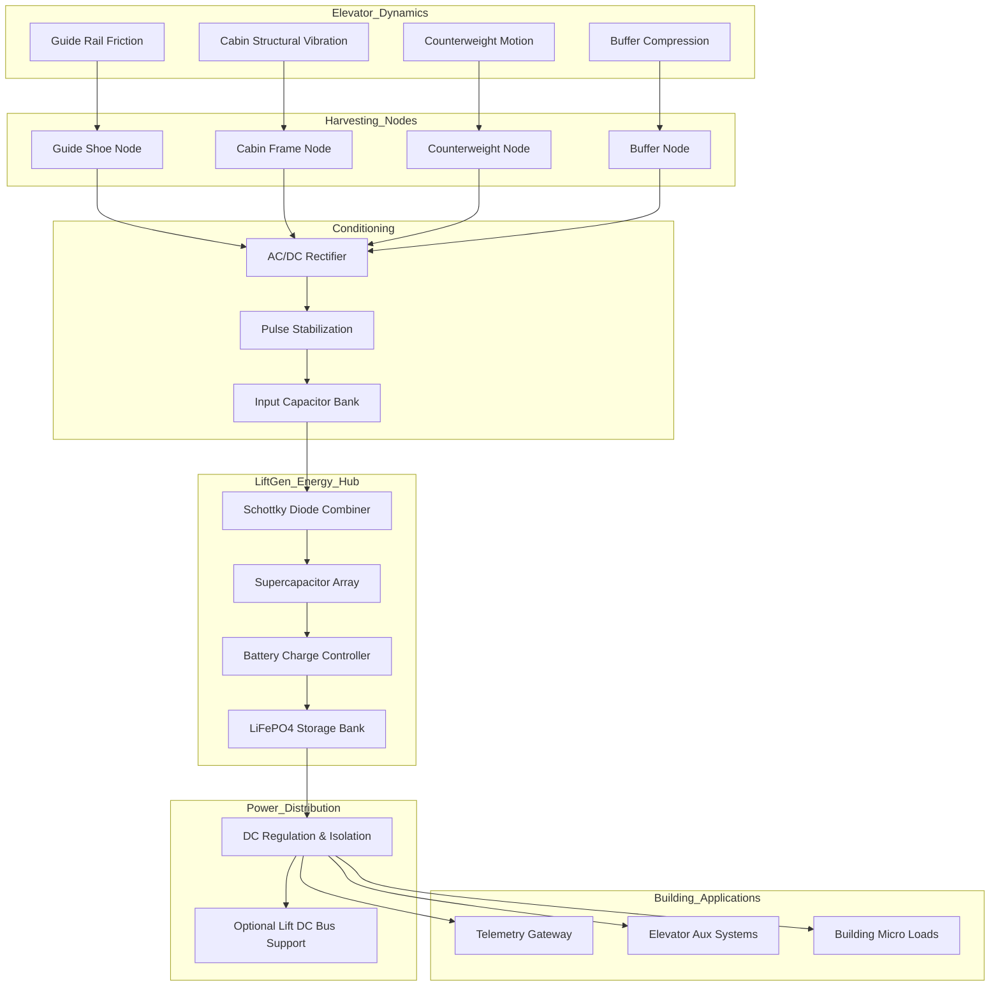
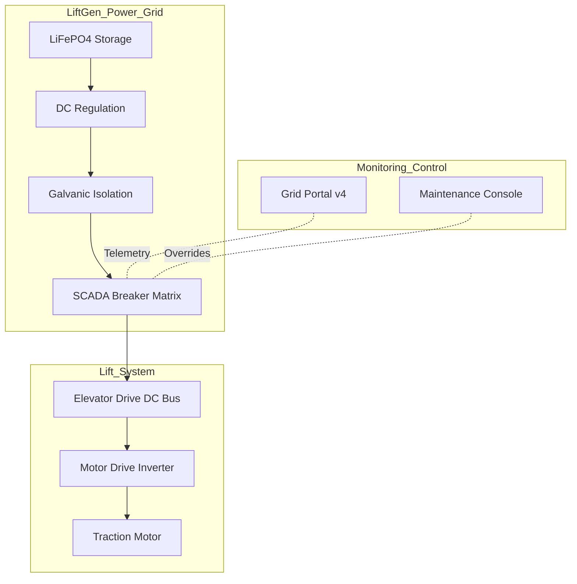
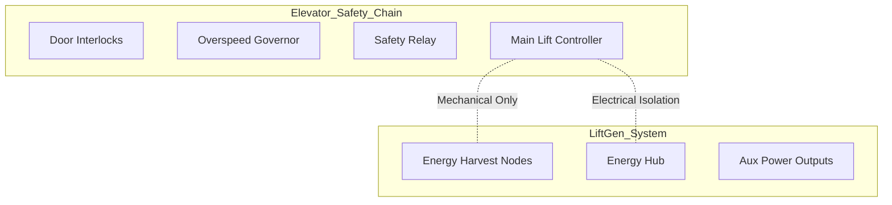

# LiftGen System Architecture — **v3 (Utility-Scale Grid)**

LiftGen is an **industrial-grade distributed elevator energy harvesting microgrid**. This version (v3) introduces a **utility-scale SCADA monitoring model**, integrating high-precision frequency tracking, ESG reporting, and command-level breaker overrides for multi-lift shaft environments.

---

# High-Level Energy Flow (v2)

---

# Hardware Interaction Model (v2)

```mermaid
graph LR

subgraph Harvesting_Node
    PG[Piezo / Micro Generator]
    RECT[Bridge Rectifier]
    BUF[Buffer Capacitor]
end

subgraph Energy_Hub
    SUM[Schottky Summing Diodes]
    SUP[Supercapacitor Bank]
    CHG[LiFePO4 Charge Controller]
    BAT[LiFePO4 Battery Pack]
end

subgraph Control_System
    REG[DC Voltage Regulation]
    MCU[Telemetry MCU]
    COM[Ethernet / RS485 / LoRa]
end

PG --> RECT
RECT --> BUF
BUF --> SUM
SUM --> SUP
SUP --> CHG
CHG --> BAT
BAT --> REG
REG --> MCU
MCU --> COM
```

---

# Lift DC Bus Integration (Future Mode)

This is the piece you hinted at earlier — **using stored energy to assist the lift system**.

Important engineering reality:

This would **not run the elevator motor fully**.
But it could:

• assist low-power DC bus electronics
• reduce standby draw
• support regenerative events
• smooth voltage dips

Think of it as **micro-support**, not full propulsion.

---

# Safety Isolation Layout

LiftGen never touches:

* brake circuits
* door locks
* safety relays
* governor systems

That separation is **non-negotiable in elevator engineering**.

---

# What Changed in **v3**

Major upgrades from the v2 architecture:

• **Utility-Scale SCADA Portal**: Implementation of a high-density, phosphor-aesthetic grid monitor.
• **High-Precision Telemetry**: Frequency dials (0.001Hz res) and spectral power density analysis.
• **ESG & Carbon Tracking**: Automated calculation of CO2 offsets and carbon credit minting logic.
• **Maintenance Command Console**: Remote breaker overrides (BRK-01/02) for safe isolation during lift maintenance.
• **Phase Balance Monitoring**: Precision tracking of L1/L2/L3 loads to prevent substation stress.

This architecture now represents a **grid-ready infrastructure platform.**
