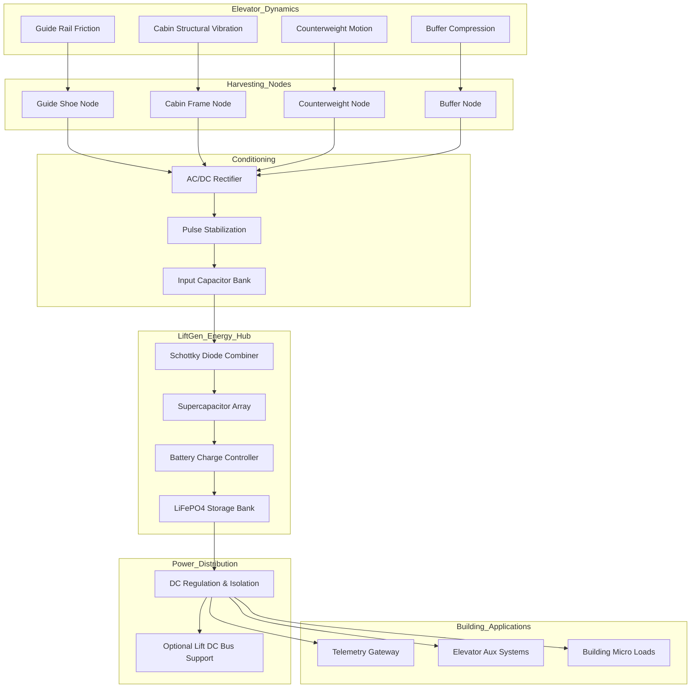

```mermaid
graph LR

subgraph Harvesting_Node
    PG[Piezo / Micro Generator]
    RECT[Bridge Rectifier]
    BUF[Buffer Capacitor]
end

subgraph Energy_Hub
    SUM[Schottky Summing Diodes]
    SUP[Supercapacitor Bank]
    CHG[LiFePO4 Charge Controller]
    BAT[LiFePO4 Battery Pack]
end

subgraph Control_System
    REG[DC Voltage Regulation]
    MCU[Telemetry MCU]
    COM[Ethernet / RS485 / LoRa]
end

PG --> RECT
RECT --> BUF
BUF --> SUM
SUM --> SUP
SUP --> CHG
CHG --> BAT
BAT --> REG
REG --> MCU
MCU --> COM
```

# LiftGen Project — Elevator Energy Harvesting & Optimization System

**LiftGen** is a retrofit energy‑harvesting and optimization platform designed for elevators. Its purpose is to capture wasted mechanical energy from lift motion, store it intelligently, and reuse it to power elevator systems, building loads, and telemetry infrastructure.

Every elevator moves significant mass thousands of times per day. LiftGen converts part of that motion into usable electricity instead of letting it dissipate as vibration, friction, and heat.

---

# Core Concept

Elevators continuously produce mechanical energy through:

• Guide rail friction
• Cabin vibration
• Counterweight motion
• Buffer compression
• Structural oscillations

LiftGen installs distributed energy harvesting nodes throughout the lift shaft to convert those mechanical effects into electrical energy.

The harvested energy is then:

1. Harvested
2. Stored
3. Optimized
4. Reused

The elevator operates normally even if LiftGen is disconnected. The system is intentionally non‑operational and non‑safety related.

---

# System Architecture

LiftGen functions as a distributed micro‑energy system inside the elevator infrastructure.

## Energy Harvesting Nodes

Nodes are installed at strategic mechanical points:

• Lift shoe nodes (guide rail friction)
• Cabin floor nodes (vibration)
• Counterweight nodes (vertical motion)
• Buffer nodes (impact compression)

These nodes use:

• Piezoelectric generators
• Micro linear generators
• Vibration harvesters

Mechanical movement is converted into low‑voltage electrical energy.

---

# Energy Aggregation

Harvested energy flows to the **LiftGen Energy Hub**.

Inside the hub:

• Schottky diode combiners merge input sources
• Supercapacitors absorb fast energy spikes
• Battery storage provides longer‑term retention

Two storage technologies are used.

**Supercapacitors**

• extremely fast charge and discharge
• ideal for motion spikes

**LiFePO₄ batteries**

• long duration storage
• safe chemistry
• supports backup power

---

# Energy Reuse

Stored energy can power several systems.

## Elevator Systems

• control electronics
• cabin lighting
• ventilation
• auxiliary loads

## Building Systems

• corridor lighting
• building sensors
• building management systems
• emergency micro‑loads

## DC Bus Support

In advanced configurations the system may supplement the lift drive DC bus to reduce grid draw during peak loads.

---

# Telemetry and Intelligence Layer

LiftGen also operates as a distributed sensor network for elevator health monitoring.

Each node can report:

• vibration levels
• energy harvested per trip
• component wear patterns
• system health metrics

Telemetry is transmitted through a gateway and visualized via monitoring dashboards.

This enables:

• predictive maintenance
• ride quality monitoring
• energy analytics
• operational optimization

---

# Safety Philosophy

Elevator engineering follows a strict principle: safety systems must never be compromised.

LiftGen respects this principle completely.

The system:

• does not control the motor
• does not affect braking
• does not interact with door locks
• does not interfere with safety circuits

The platform remains electrically isolated from safety‑critical components. If LiftGen fails, the elevator continues operating normally.

---

# Key Benefits

## Energy Efficiency

Captures energy that would otherwise be wasted.

## Reduced Operating Costs

Reduces electricity consumption for elevators and supporting loads.

## Backup Power Capability

Stored energy can maintain essential electronics during outages.

## Predictive Maintenance

Continuous telemetry improves reliability and service planning.

## Retrofit Friendly

Designed to install on existing elevators without modifying core lift controls.

---

# Long‑Term Vision

LiftGen transforms elevators from pure energy consumers into micro energy producers.

In buildings with multiple elevators the system becomes a distributed energy network that:

• harvests motion energy
• stores it locally
• redistributes it intelligently

Over time elevators become part of the building's broader energy ecosystem rather than simply another electrical load.

---

# One‑Sentence Summary

**LiftGen is a distributed elevator energy harvesting and storage platform that converts lift motion into usable electricity while providing telemetry, backup power, and building energy optimization.**

---

# LiftGen System Architecture — v3 (Utility-Scale Grid)

LiftGen v3 extends the platform into an industrial‑grade distributed elevator energy harvesting microgrid. This architecture introduces SCADA monitoring, precision telemetry, and grid‑style management suitable for multi‑elevator installations and smart building infrastructure.

---

# High‑Level Energy Flow (v2 Baseline)

Elevator mechanical dynamics generate recoverable micro‑energy through several sources:

• Guide rail friction
• Cabin structural vibration
• Counterweight motion
• Buffer compression

These sources feed harvesting nodes installed at strategic mechanical points inside the lift shaft.

Harvesting nodes convert mechanical motion into electrical energy which then flows through the LiftGen conditioning and storage pipeline:

Mechanical Motion → Harvesting Nodes → Rectification → Pulse Stabilization → Capacitor Buffering → Energy Hub → Storage → Power Distribution

The stored energy is then routed to building telemetry systems, elevator auxiliary systems, and optional DC bus support.

---

# Hardware Interaction Model

Each harvesting node contains a compact generator module that converts vibration or motion into electrical output.

Typical node architecture:

Piezoelectric or Micro‑Generator
↓
Bridge Rectifier
↓
Buffer Capacitor
↓
Energy Aggregation Bus

Multiple nodes feed the LiftGen Energy Hub where energy is stabilized and stored.

Inside the Energy Hub:

• Schottky diode summing network
• Supercapacitor bank for rapid energy absorption
• LiFePO4 battery charge controller
• Long‑duration battery storage pack

This hybrid storage approach allows the system to handle both short motion spikes and longer energy accumulation cycles.

---

# Lift DC Bus Integration (Future Mode)

LiftGen may optionally support the elevator drive DC bus using isolated micro‑power injection.

Energy flow in this configuration:

LiFePO4 Storage → DC Regulation → Galvanic Isolation → Breaker Matrix → Elevator DC Bus

The injected energy is not intended to power the traction motor directly. Instead it provides micro‑support functions such as:

• reducing standby electrical draw
• assisting low‑power electronics
• smoothing transient voltage dips
• supporting regenerative braking events

This approach maintains elevator safety integrity while still allowing energy optimization.

---

# Safety Isolation Architecture

Elevator safety circuits remain completely isolated from the LiftGen system.

LiftGen does not interact with:

• brake circuits
• door interlock chains
• overspeed governors
• safety relays

The only relationship between the elevator control system and LiftGen is passive mechanical energy harvesting and optional isolated auxiliary power support.

If LiftGen is disabled or removed, the elevator continues operating normally.

---

# SCADA Monitoring Layer (v3)

Version 3 introduces a SCADA‑style monitoring environment for building operators and infrastructure managers.

The monitoring system aggregates telemetry from all LiftGen nodes and energy hubs in the building.

Capabilities include:

• real‑time energy generation dashboards
• vibration spectrum analysis
• node health diagnostics
• energy flow visualization

Telemetry may be transmitted using Ethernet, RS‑485, or low‑power wireless protocols depending on installation requirements.

---

# ESG and Carbon Accounting

LiftGen can estimate avoided grid consumption and calculate approximate carbon offset values.

Metrics tracked include:

• total harvested energy (Wh)
• estimated CO₂ offset
• energy reuse within building systems

These values can be integrated into building sustainability reporting frameworks and ESG dashboards.

---

# Maintenance Command Console

The system includes a maintenance control interface allowing authorized technicians to isolate sections of the LiftGen energy grid.

Functions include:

• remote breaker isolation
• node diagnostics
• firmware updates
• system restart procedures

Isolation is handled through a controlled breaker matrix to ensure safe service conditions.

---

# Phase Balance Monitoring

In multi‑elevator installations the platform can monitor building electrical phases.

Telemetry can track:

• L1 / L2 / L3 load balance
• energy injection levels
• localized electrical stress indicators

This information helps building engineers optimize power distribution and prevent uneven phase loading.

---

# Architecture Summary

LiftGen v3 transforms elevator shafts into distributed micro‑energy generators combined with infrastructure telemetry networks.

The system harvests mechanical energy, stabilizes and stores it locally, and redistributes it for auxiliary building loads while providing continuous monitoring of elevator structural dynamics and energy behavior.

In large buildings with multiple elevators, LiftGen becomes a small but meaningful part of the building’s broader energy ecosystem.

---

# Visual System Diagrams (Mermaid)

## High-Level Energy Flow

---

## Hardware Interaction Model

---

## Lift DC Bus Integration (Future Mode)

---

## Safety Isolation Layout

