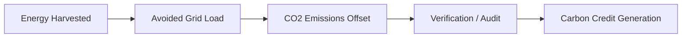

# LiftGen Carbon Credit Implementation Strategy

## 1. The Core Mechanism
To link LiftGen to carbon credits, the system must transform raw energy data into **Verifiable Carbon Offsets (VCOs)**. The journey from "Joules harvested" to "Carbon Credits" follows this lifecycle:

## 2. Methodology (GHG Protocol)
The conversion relies on the **Grid Emission Factor (GEF)** of the local utility (e.g., Kenya Power).
*   **Kenya Average GEF**: ~0.33 kg CO2 per kWh (Kenya has a green grid, but many commercial hubs rely on diesel backup).
*   **Formula**: `kWh Harvested * GEF = kg CO2 Offset`.
*   **Standard Unit**: 1 Carbon Credit = 1,000 kg (1 Tonne) of CO2 offset.

## 3. Verification & Trust (MRV)
"Measurement, Reporting, and Verification" (MRV) is the threshold for tradable credits:
1.  **Tamper-Proof Logging**: LiftGen Hubs sign telemetry data with cryptographic keys.
2.  **Blockchain Integration (Optional)**: Recording offsets on a distributed ledger (like Hedera or Ethereum) creates a transparent audit trail.
3.  **Third-Party Audits**: Verification by bodies like **Gold Standard** or **Verra** to certify the energy-saving methodology.

## 4. Economic Value
Carbon credits are traded in the **Voluntary Carbon Market (VCM)**:
*   **Estimated Price**: Ksh. 1,300 - Ksh. 2,600 ($10 - $20) per tonne.
*   **LiftGen ROI**: While a single elevator offsets kilograms, a fleet of 100 elevators in a commercial tower creates a continuous stream of tradable value.

## 5. Integration Path for LiftGen
*   **Phase 1 (Simulation)**: Use GEF math in the dashboard (Implemented).
*   **Phase 2 (Telemetry)**: Export signed JSON bundles to a secondary verification API.
*   **Phase 3 (registry)**: Automated registration of offsets to an ESG reporting platform (e.g., Salesforce Net Zero Cloud).
